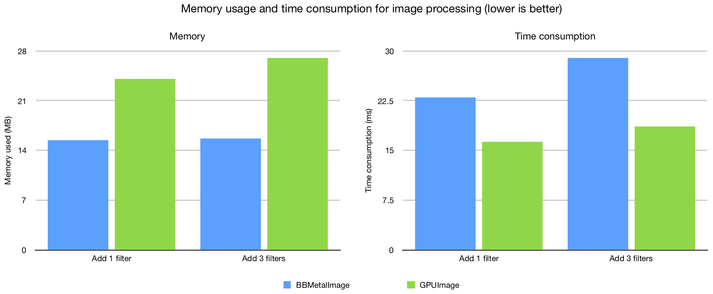
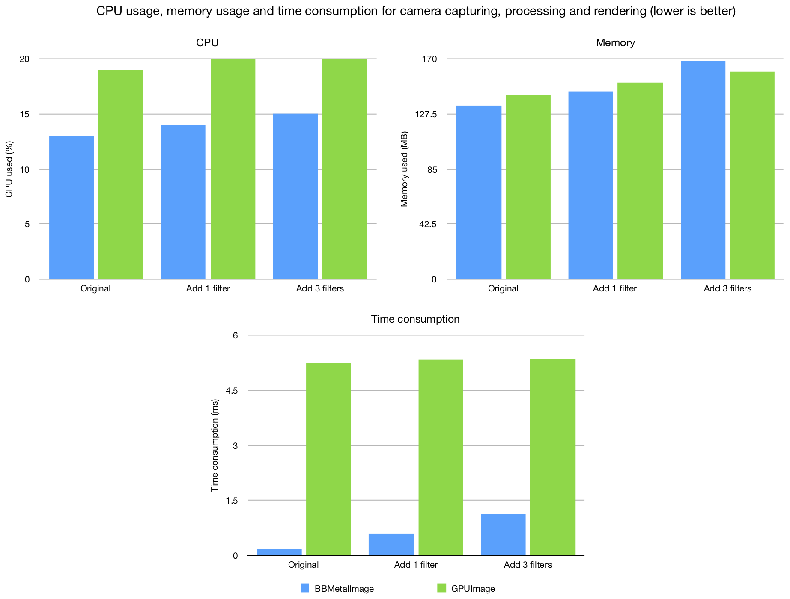

# BBMetalImage

A high performance Swift library for GPU-accelerated image/video processing based on Metal.

This library is highly inspired by GPUImage.

## Performance

Test libraries are BBMetalImage (0.1.1) and GPUImage (0.1.7). Test device is iPhone 7 with iOS 12.1. The code can be found in [CompareImageLib](CompareImageLib) project and the test result data can be found in [CompareImageLib.numbers](README_resources/CompareImageLib.numbers).

- BBMetalImage has low memory usage for processing image.



- BBMetalImage has low CPU usage and high speed for camera capturing, processing and rendering. 



## Features

- [x] More than 60 built-in filters
- [x] Filter chain supported
- [x] Customized filter
- [x] High performance

## Requirements

- iOS 10.0+
- Swift 4.2

## Installation

Install with CocoaPods:

1. Add `pod 'BBMetalImage'` to your Podfile.
2. Run `pod install` or `pod update`.
3. Add `import BBMetalImage` to the Swift source file.

##  How to Use

### Single filter

Call `filteredImage(with:)` method of a filter is the simplest way to get filtered image synchronously.

```swift
let filteredImage = BBMetalContrastFilter(contrast: 3).filteredImage(with: image)
```

### Filter Chain

The code below:

1. Captures image with a camera
2. The image captured by the camera is processed by 3 filters
3. The processed image is rendered to the metal view

```swift
// Hold camera
var camera: BBMetalCamera!

func setup() {
    // Set up Camera to capture image
    camera = BBMetalCamera(sessionPreset: .high)!

    // Set up 3 filters to process image
    let contrastFilter = BBMetalContrastFilter(contrast: 3)
    let lookupFilter = BBMetalLookupFilter(lookupTable: UIImage(named: "test_lookup")!.bb_metalTexture!)
    let sharpenFilter = BBMetalSharpenFilter(sharpeness: 1)

    // Set up metal view to display image
    let metalView = BBMetalView(frame: frame)
    view.addSubview(metalView)

    // Set up filter chain
    camera.add(consumer: contrastFilter)
        .add(consumer: lookupFilter)
        .add(consumer: sharpenFilter)
        .add(consumer: metalView)

    // Start capturing
    camera.start()
}
```

#### Process image synchronously

```swift
// Set up image source
let imageSource = BBMetalStaticImageSource(image: image)

// Setup 3 filters to process image
let contrastFilter = BBMetalContrastFilter(contrast: 3)
let lookupFilter = BBMetalLookupFilter(lookupTable: UIImage(named: "test_lookup")!.bb_metalTexture!)
let sharpenFilter = BBMetalSharpenFilter(sharpeness: 1)

// Set up filter chain
// Make last filter run synchronously
imageSource.add(consumer: contrastFilter)
    .add(consumer: lookupFilter)
    .add(consumer: sharpenFilter)
    .runSynchronously = true

// Start processing
imageSource.transmitTexture()

// Get filtered image
let filteredImage = sharpenFilter.outputTexture?.bb_image
```

#### Process image asynchronously

```swift
// Hold image source
var imageSource: BBMetalStaticImageSource!

func process() {
    // Set up image source
    imageSource = BBMetalStaticImageSource(image: image)
    
    // Setup 3 filters to process image
    let contrastFilter = BBMetalContrastFilter(contrast: 3)
    let lookupFilter = BBMetalLookupFilter(lookupTable: UIImage(named: "test_lookup")!.bb_metalTexture!)
    let sharpenFilter = BBMetalSharpenFilter(sharpeness: 1)
    
    // Set up filter chain
    // Add complete handler to last filter
    weak var wLastFilter = sharpenFilter
    imageSource.add(consumer: contrastFilter)
        .add(consumer: lookupFilter)
        .add(consumer: sharpenFilter)
        .addCompletedHandler { [weak self] _ in
            if let filteredImage = wLastFilter?.outputTexture?.bb_image {
                DispatchQueue.main.async {
                    guard let self = self else { return }
                    // Display filtered image
                }
            }
    }
    
    // Start processing
    imageSource.transmitTexture()
}
```

## Built-in Filters

- Brightness
- Exposure
- Contrast
- Saturation
- Gamma
- Levels
- Color Matrix
- RGBA
- Hue
- Vibrance
- White Balance
- Highlight Shadow

- Highlight Shadow Tint
- Lookup
- Color Inversion
- Monochrome
- False Color
- Haze
- Luminance
- Luminance Threshold
- Chroma Key
- Crop
- Resize
- Rotate
- Flip
- Sharpen
- Unsharp Mask
- Gaussian Blur
- Box Blur
- Zoom Blur
- Motion Blur
- Tilt Shift
- Blend Modes
  - Normal
  - Chroma Key
  - Dissolve
  - Add
  - Subtract
  - Multiply
  - Divide
  - Overlay
  - Darken
  - Lighten
  - Color
  - Color Burn
  - Color Dodge
  - Screen
  - Exclusion
  - Difference
  - Hard Light
  - Soft Light
  - Alpha
  - Source Over
  - Hue
  - Saturation
  - Luminosity
  - Linear Burn
  - Mask

- Pixellate
- Polar Pixellate
- Polka Dot
- Halftone
- Crosshatch
- Sketch
- Threshold Sketch
- Toon
- Posterize
- Swirl

## License

BBMetalImage is released under the MIT license. See [LICENSE](LICENSE) for details.